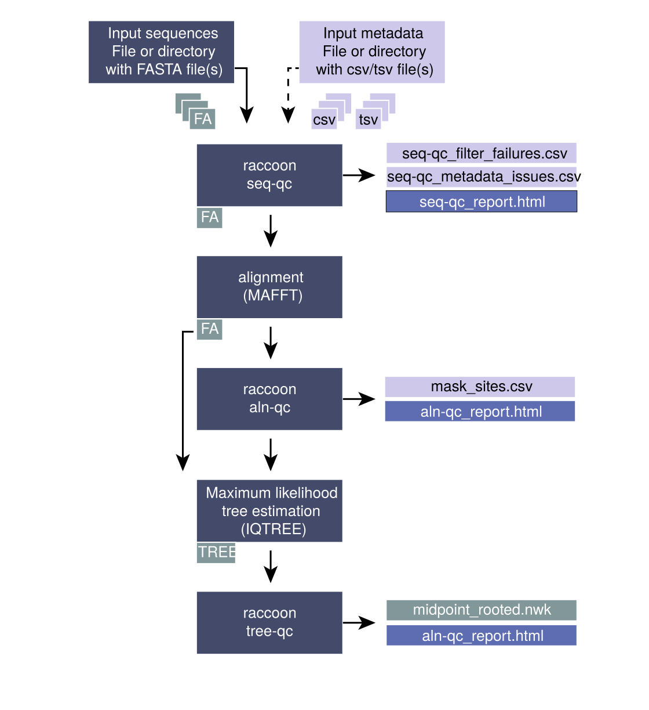

# raccoon

<p align="center">
  
</p>

<p align="center"><strong>Rigorous Alignment Curation: Cleanup Of Outliers and Noise</strong></p>

Raccoon is a lightweight toolkit for post-consensus genomic QC and phylogenetic quality control. It provides modular tools for sequence metadata harmonization, alignment curation, and phylogenetic tree assessment. Raccoon identifies problematic sequences and sites (e.g., clustered SNPs, SNPs near Ns/gaps, frame‑breaking indels, long branches, and convergent mutations) and produces detailed reports, mask files, and curated datasets for downstream analyses.

**Rationale:** Quality assessment and curation of genomic sequence data is essential for robust phylogenetic inference. By systematically evaluating sequence quality, alignment accuracy, and tree topology, raccoon helps researchers identify and address data issues that could compromise epidemiological or evolutionary conclusions before proceeding with downstream analysis.

## Example reports

Example reports are available in the [`docs/`](docs/) folder:

- [Sequence QC report](docs/seq-qc_report.html)
- [Alignment QC report](docs/aln-qc_report.html)
- [Masking report](docs/mask_report.html)
- [Phylogenetic QC report](docs/tree-qc_report.html)

There is also an interactive pipeline with details on an example workflow for raccoon. See [raccoon-nf](#integrated-workflows) for an integrated workflow.
- [Interactive pipeline](docs/interactive_pipeline.html)

---

## Contents

- [Use cases](#use-cases)
- [Installation](#installation)
- [Typical Workflow](#typical-workflow)
- [Integrated workflows](#integrated-workflows)
- [CLI usage](#cli-usage)
- [Output Descriptions](#output-descriptions)
- [Mask notes](#mask-notes)
- [Example data](#example-data)
- [Tutorial](#tutorial)

## Use cases

### Sequence QC
- Harmonise sequence headers using metadata files (CSV/TSV) with flexible templating.
- Match sequence identifiers to metadata and flag mismatches or missing fields.
- Filter sequences by length and ambiguous base content.
- Generate combined FASTA files with structured, epidemiologically-informative headers.

### Alignment QC
- Flag clustered SNPs that may indicate contamination, recombination, or misalignment.
- Detect SNPs adjacent to low-coverage regions (Ns) or gaps, which may reflect data quality issues.
- Identify frame-breaking indels in coding regions using a GenBank reference.
- Generate detailed reports on alignment quality with visual summaries of site conservation and N-content.

### Masking
- Generate mask files to exclude suspect sites or sequences prior to phylogenetic analysis.
- Apply masks to alignments using customizable masking characters.

### Phylogenetic QC
- Assess tree topology for anomalies including long branches and unexpected clustering.
- Evaluate molecular clock assumptions via root-to-tip regression analysis.
- Detect sources of bias including APOBEC3-mediated and ADAR-induced mutations.
- Flag convergent mutations and reversion events (when ancestral state reconstruction is available).
- Identify sequences for removal prior to downstream temporal or evolutionary analyses.


## Typical Workflow


Running best-practice phylogenetics can be challenging, however with raccoon a simple alignment and phylogenetic workflow can be customised with data quality in mind.

<p align="center">
  
</p>

A) *Input files*
- input sequences (one or more fasta files or directory containing fasta file)
- input metadata (one or more metadata files (csv or tsv) or directory containing metadata files)

B) *raccoon seq-qc*

Outputs:
- a combined fasta file with sequence headers harmonised and populated from the metadata fields
- seq-qc_report.html (a report describing the dataset, the matching, the output and any issues identified with the data)
- seq-qc_filter_failures.csv (sequences that do not pass qc filters, max n and min length)
- seq-qc_metadata_issues.csv (flagging missing metadata fields or sequences that failed to match metadata)

C) *alignment*

Multiple sequence alignment is a key step prior to running phylogenetics. It is the scaffold upon which we can begin to reconstruct the evolutionary relationships between different sequences in the tree. We will run alignment using [MAFFT](https://academic.oup.com/nar/article/30/14/3059/2904316), which is a popular software tool for creating multiple sequence alignments. 

Output:
- An aligned fasta file

D) *raccoon aln-qc*

 A high-quality alignment is crucial to generating a good phylogenetic tree. Being able to accurately assess whether there are issues with your multiple sequence alignment is a key skill that we will cover today. 
 
 The alignment is checked for various issues that may impact the quality of the phylogenetic inference. Different kinds of SNPs (clustered SNPs, N-adjacent SNPs, gap-adjacent SNPs) are flagged that may suggest issues with the alignment or with a given sequence. If a given sequence has many issues flagged (default >20), that sequence is flagged for removal from the analysis. Flagged SNPs do not necessarily mean there is anything wrong with the SNP, it may reflect genuine biological variation. However, these sites may need to be investigated closely.

Output:
- aln-qc_report.html (a report describing the input alignment, n content and any SNPs that were flagged as possibly pro)
- mask_sites.csv (describes the sites flagged for investigation or masking and the sequences flagged for removal)

E) *tree estimation*
Tree building is run using [IQTREE](https://academic.oup.com/mbe/article/37/5/1530/5721363). The substitution model used is configurable and an outgroup can optionally be included. If an outgroup is included, ancestral state reconstruction will be run during the tree building process to provide additional checks on the tree, and the outgroup sequence will be pruned off from the final tree. In this case, as we are not yet familiar with the data, we will not select an outgroup as it is not clear what an appropriate outgroup would be.

Key output:
- *.treefile (a maximum likelihood tree file)

F) *raccoon tree-qc*

Output:
- tree-qc_report.html (report showing the tree, a root to tip and any issues that were flagged during the tree-qc process)
- *.phylo_flags.csv
- A midpoint rooted tree (if no outgroup provided)
- Branch reconstruction file (if outgroup provided)
- State difference file (if outgroup provided)


A typical raccoon workflow progresses through four main stages:

1. **Sequence QC** – Combine and harmonize sequence metadata across multiple input files
2. **Alignment** – Generate a multiple sequence alignment (using external tools like MAFFT)
3. **Alignment QC** – Flag problematic sites and generate a mask file
4. **Optional Masking** - If the sites flagged appear to need removal from the sequences, the alignment can be masked using this step
4. **Tree estimation** - Estimate a maximum likelihood phylogeny (using external tools like IQTREE)
4. **Phylogenetic QC** – Assess tree quality and identify outlier sequences


### Step 1: Sequence Quality Control

Start by harmonizing sequence headers and combining multiple FASTA files:

```bash
raccoon seq-qc -f samples_batch1.fasta samples_batch2.fasta \
  -m metadata.csv \
  --metadata-id-field sample_id \
  --metadata-location-field location \
  --metadata-date-field collection_date \
  -o combined_sequences.fasta
```

**Input:** 
- Raw FASTA files and metadata CSV/TSV files
**Output:** 
- `combined_sequences.fasta` with structured headers (e.g., `sample_id|location|date`)
- A seq-qc html report describing the metadata matching, header harmonisation and sequence QC filters applied

### Step 2: Multiple Sequence Alignment

Align sequences using MAFFT (or another aligner):

```bash
mafft --auto combined_sequences.fasta > alignment.fasta
```

**Input:** Combined FASTA file  
**Output:** Multiple sequence alignment in FASTA format

### Step 3: Alignment Quality Control

Assess alignment quality and identify suspect sites:

```bash
raccoon aln-qc alignment.fasta -d alignment_qc_results \
  --reference-id reference_seq_id
```

**Input:** 
- Aligned FASTA file 
**Output:** 
- Mask file, detailed flags, and HTML report (see [Output Descriptions](#output-descriptions))
- aln-qc html report describing the 

### Step 4: Apply Mask (Optional)

Exclude flagged sites from downstream analysis:

```bash
raccoon mask alignment.fasta \
  --mask-file alignment_qc_results/mask_sites.csv \
  -d alignment_qc_results \
  -o alignment.masked.fasta
```

**Input:** Alignment FASTA file and mask CSV  
**Output:** Masked alignment with flagged sites replaced by mask character

### Step 5: Phylogenetic Inference

Build phylogeny (using IQ-TREE or similar):

```bash
iqtree -s alignment.masked.fasta -m GTR+G -bb 1000 -alrt 1000
```

**Output:** `.treefile` (phylogeny) and `.state` (ancestral state reconstruction, if using IQ-TREE)

### Step 6: Phylogenetic Quality Control

Assess tree topology and identify problematic sequences:

```bash
raccoon tree-qc --tree alignment.masked.fasta.treefile \
  --alignment alignment.masked.fasta \
  --asr-state alignment.masked.fasta.state \
  -d tree_qc_results \
  --run-adar --adar-window 300 --adar-min-count 3 \
  --run-apobec
```

**Input:** Tree file, alignment FASTA, and ASR state file  
**Output:** Interactive HTML report and flagged sequence list


## Integrated workflows

### raccoon-nf: End-to-end Nextflow pipeline

For complete phylogenetic quality-control workflows, **[raccoon-nf](https://github.com/Desperate-Dan/raccoon-nf)** integrates raccoon's modular tools with alignment and tree-building software (MAFFT, IQ-TREE) in a production-ready Nextflow pipeline. The raccoon-nf pipeline coordinates all QC steps in sequence:

1. **Sequence QC** – harmonise headers and filter sequences
2. **Alignment** – run MAFFT on combined sequences
3. **Alignment QC** – assess alignment quality and flag problematic sites
4. **Tree estimation** – build phylogenetic tree with IQTREE
5. **Tree QC** – evaluate tree topology and identify outliers

raccoon-nf can be run through the **EPI2ME** desktop interface for users without command-line expertise. See the [tutorial](#tutorial) for a complete walkthrough.

## Stand alone installation

From source:

```bash
pip install artic-raccoon
```

## CLI usage
Show help:

```bash
raccoon --help
```

### Sequence QC (`seq-qc`)

Basic usage:

```bash
raccoon seq-qc -f a.fasta b.fasta -o combined.fasta
```

With metadata-driven headers:

```bash
raccoon seq-qc -f a.fasta b.fasta -o combined.fasta \
  -m metadata.csv other_metadata.csv \
  --metadata-id-field sample \
  --metadata-location-field location \
  --metadata-date-field date \
  --header-separator '|'
```

With a custom header template:

```bash
raccoon seq-qc -f a.fasta b.fasta -o combined.fasta \
  -m metadata.csv --header-fields "{id}|{country}|{date}"
```

Key options:

- `-f, --fasta`: input FASTA files (one or more) (required)
- `-o, --outfile`: output FASTA file (default: `combined.fasta`; use `-` for stdout)
- `-m, --metadata`: metadata CSV file(s) for header harmonisation
- `--metadata-delimiter`: metadata delimiter (default `,`; `.tsv` auto-detected)
- `--metadata-id-field`: metadata ID column (default: `sample`)
- `--metadata-location-field`: metadata location column (default: `location`)
- `--metadata-date-field`: metadata date column (default: `date`)
- `--header-fields`: template for custom headers (e.g. `{id}|{country}|{date}`)
- `--header-separator`: separator used for non-template harmonised headers (default: `|`)
- `--seq-id-delimiter`: delimiter for parsing IDs from input headers (default: `|`)
- `--seq-id-field-index`: 0-based field index for parsed sequence ID (default: `0`)
- `--min-length`: minimum sequence length to keep
- `--max-n-content`: maximum N-content proportion to keep

### Alignment QC (`aln-qc`)

Basic usage:

```bash
raccoon aln-qc <alignment.fasta> -d outdir
```

With GenBank reference for frame-break checks:

```bash
raccoon aln-qc <alignment.fasta> -d outdir \
  --genbank <reference.gb> --reference-id <ref_id>
```

Disable selected flag classes:

```bash
raccoon aln-qc <alignment.fasta> -d outdir \
  --no-flag-n-adjacent --no-flag-gap-adjacent
```

Key options:

- `alignment` (positional): input alignment FASTA file (required)
- `-d, --outdir`: output directory (default: `.`)
- `-t, --sequence-type`: sequence type, `nt` or `aa` (default: `nt`)
- `--genbank`: GenBank file for frame-breaking indel checks
- `--reference-id`: reference sequence ID in alignment (for GenBank features)
- `--max-n-content`: N-content threshold for flagging
- `--cluster-window`: window size (bp) for clustered SNP detection
- `--cluster-count`: minimum SNPs in-window to mark as clustered
- `--no-flag-clustered`: skip clustered SNP flagging
- `--no-flag-n-adjacent`: skip N-adjacent SNP flagging
- `--no-flag-gap-adjacent`: skip gap-adjacent SNP flagging
- `--no-flag-frame-break`: skip frame-breaking indel flagging
- `--flag-removal-threshold`: mark sequence for removal above this flagged-site count

### Apply mask (`mask`)

```bash
raccoon mask <alignment.fasta> \
  --mask-file results/alignment_qc/mask_sites.csv \
  -d results/alignment_qc
```

Key options:

- `--mask-file`: mask CSV file from `aln-qc`
- `--mask-character`: character to use for masking (default: `?`)
- `-o, --outfile`: output masked alignment file name
- `-d, --outdir`: output directory
- `-t, --sequence-type`: `nt` or `aa` (default: `nt`)

### Phylogenetic QC (`tree-qc`)

Basic usage:

```bash
raccoon tree-qc --tree <treefile> -d outdir \
  --alignment <alignment.fasta> --asr-state <treefile>.state \
  --run-adar --adar-window 300 --adar-min-count 3
```

Key options:

- `-t, --tree`: input phylogeny file (required)
- `-d, --outdir`: output directory (default: `.`)
- `--tree-format`: `auto`, `newick`, or `nexus` (default: `auto`)
- `--alignment`: alignment FASTA used with ASR state file
- `--asr-state`: ancestral state reconstruction file in IQTREE format
- `--assembly-refs`: assembly/reference FASTA used for mapping
- `--outgroup-ids`: comma-separated outgroup sequence IDs
- `--mask-file`: optional mask CSV with sites to ignore
- `--tip-fields`: template for parsing tip-label fields
- `--tip-field-delimiter`: delimiter used for tip field parsing
- `--tip-date-field`: field name treated as date in tip parsing
- `--long-branch-sd`: SD threshold for long-branch flagging (default: `3.0`)
- `--midpoint-root`: midpoint-root tree for report visualisation (applied only when `--asr-state` is not provided)
- `--run-apobec`: run APOBEC3 checks
- `--run-adar`: run ADAR checks
- `--adar-window`: max distance (bp) for ADAR cluster window (default: `300`)
- `--adar-min-count`: min ADAR sites in window to flag branch (default: `3`)
- `--height`: optional figure height

See full CLI details in [docs/cli.md](docs/cli.md).

## Output Descriptions

### `seq-qc` outputs

- **Combined FASTA file** (e.g., `combined.fasta`): Sequences with harmonized headers, upper-case, single-line format
- **Statistics (logged to console)**: Summary of:
  - Total sequences processed
  - Sequences retained vs filtered
  - Metadata matches/mismatches
  - Sequences failing length and N-content filters

### `aln-qc` outputs

Generated in the specified output directory (default: `.`):

- **`mask_sites.csv`**: Tab-separated file listing flagged sites with flag types (clustered_snps, N_adjacent, gap_adjacent, frame_break)
- **`alignment_flags.tsv`**: Detailed per-sequence report showing all flagged sites for each sequence
- **`alignment_qc_report.html`**: Interactive HTML report with:
  - Alignment conservation visualization
  - N-content and gap distribution plots
  - Interactive flags table
  - Recommendations for problematic sequences
- **`alignment_summary.txt`**: Text summary of flagging statistics

### `mask` outputs

- **Masked alignment FASTA** (e.g., `alignment.masked.fasta`): Original alignment with flagged sites replaced by mask character (default: `?`)
- **Masking report (logged to console)**: Summary of sites and sequences masked

### `tree-qc` outputs

Generated in the specified output directory (default: `.`):

- **`tree_qc_report.html`**: Interactive HTML report featuring:
  - Phylogenetic tree visualization with branch coloring by flagged issues
  - Long-branch flagging with branch-length deviations
  - APOBEC3-mediated and ADAR-induced mutation clusters (if runs enabled)
  - Convergent mutation and reversion detection
  - Root-to-tip regression plots for temporal signal assessment
- **`flagged_sequences.txt`**: List of sequences recommended for removal with justification
- **`convergent_mutations.csv`** (if ASR provided): Convergent mutations detected
- **`tree_summary.txt`**: Text summary of tree QC findings

## Mask notes

Mask output uses the following note values:

| Note | Meaning |
| --- | --- |
| clustered_snps | Clustered SNPs within the configured window. |
| N_adjacent | SNPs adjacent to an N run within the configured window. |
| gap_adjacent | SNPs adjacent to a gap within the configured window. |
| frame_break | Gap sites that break the CDS frame length. |

## Example data

The [examples](examples) folder includes a constructed alignment and GenBank reference suitable for quick testing:

- [input_files.zip](examples/input_files.zip)

## Tutorial

A tutorial covering sequence metadata harmonisation, multiple sequence alignment, alignment curation, phylogenetic inference, and tree assessment is available at [artic.network/tutorials/raccoon.nf](https://artic.network/tutorials/raccoon-nf). The tutorial includes:

- Step-by-step guidance on preparing sequence and metadata files.
- Instructions for running raccoon-nf through the EPI2ME interface.
- Interpretation of QC reports and identification of common data issues.
- Best practices for curating alignments and assessing phylogenetic results.
- Interactive exercises using provided example datasets.

The tutorial is suitable for both guided workshop delivery and self-paced learning.