{% include callout.html
type='default'
content='**Overview:** A complete tutorial to combine newly generated consensus genome sequences with background and metadata, running sequence and metadata quality control, multiple sequence alignment, site masking or problematic sequence removal, maximum likelihood phylogenetic inference, and tree quality assessment. The software tools used today include the raccoon toolkit, MAFFT and IQTREE, run through a Nextflow pipeline within the EPI2ME interface.  Raccon, MAFFT and IQTREE can be used as command line tools, with full command-line documentation available for raccoon available at (github.com/artic-network/raccoon)[https://github.com/artic-network/raccoon].
'
%}

## Background

Working with multiple FASTA files and creating clear, informative headers for phylogenetic analysis can be much easier with the right tools and guidance. For those who may be less familiar with coding or the command line, tasks such as merging FASTA files or structuring metadata-rich headers can be time-consuming, especially when done manually. This tutorial introduces practical approaches that simplify these steps and help reduce the chance of errors in metadata or sequence entries.

In addition, understanding and critical evaluation of the quality of results is an important part of viral phylogenetics. This tutorial will guide you through sequence quality-control steps, highlight potential issues that can arise during multiple sequence alignment, and help you confidently assess and interpret the resulting phylogenetic trees.

---

## Learning outcomes

By the end of the session, participants should be able to:

- Interpret key outputs from raccoon modules `seq-qc`, `aln-qc`, `mask`, and `tree-qc`.
- Explain why metadata harmonisation is essential before phylogenetic analysis.
- Identify common metadata and sequence quality problems and describe their downstream impact.
- Understand the importance of alignment curation, and the impact of alignment issues on phylogenetic inference.
- Understand the difference between analysis that includes **cases-only** versus **cases + historical** context data, and appreciate the importance of background data and sampling bias.
- Critically assess root-to-tip plots, tree structure, and phylogenetic signals that may indicate upstream analytical issues.

---


## Delivery format (EPI2ME + teaching mode)

In this tutorial, the pipeline will be run using the EPI2ME user interface. Users do not need to run every command manually, and do not need knowledge of the command line to run raccoon, however they should understand each stage. Users that are familiar with the command line can run different modules independently in their own custom workflows to aid in post-consensus analysis QC.


## Prerequisites

- Docker
- EPI2ME

## Setup

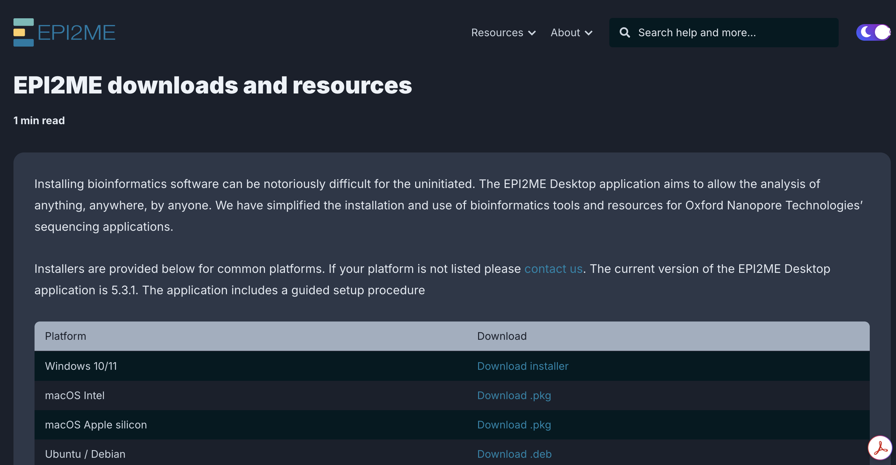

1. Today we will run the raccoon-nf pipeline through the [EPI2ME](https://labs.epi2me.io/downloads/) user interface. Please first install the EPI2ME desktop application using the provided link. Follow the setup instructions in the package to install and run EPI2ME.


2. Once you have successfully installed, launch EPI2ME. 

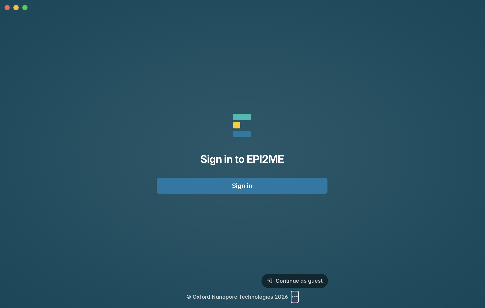

3. To access EPI2ME without creating an account, click on the three dots at the bottom of the window, and click "Continue as guest". 

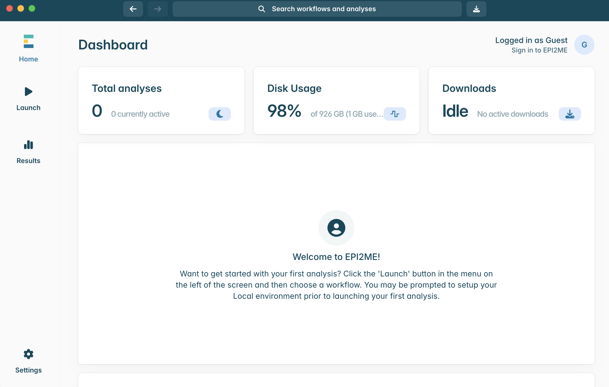

4. When you have successfully launched EPI2ME, you should see the above screen. To install the raccoon-nf pipeline, click to open the "Launch" window in the panel on the left hand side. 

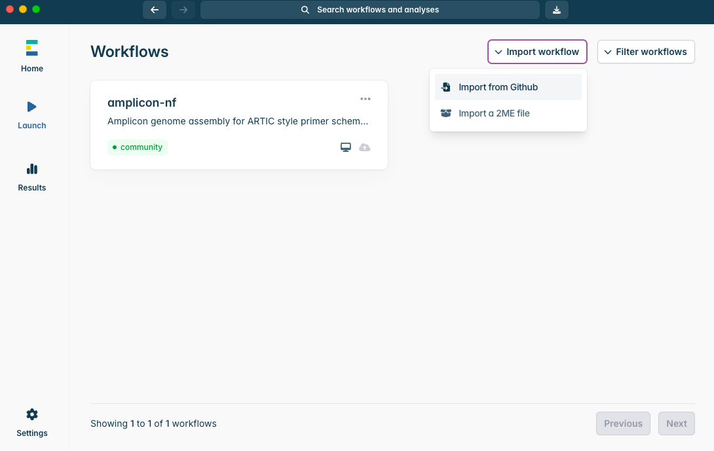

5. Click on "Import workflow" in the top right of the window, and then "Import from GitHub".

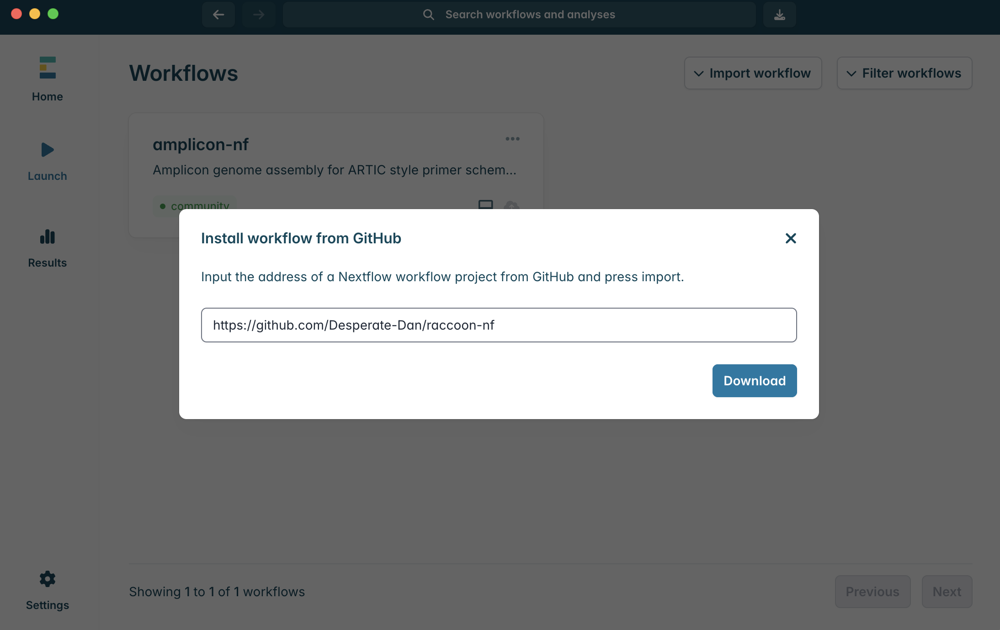

6. To import the raccoon-nf workflow, paste "https://github.com/Desperate-Dan/raccoon-nf" into the box and click "Download".

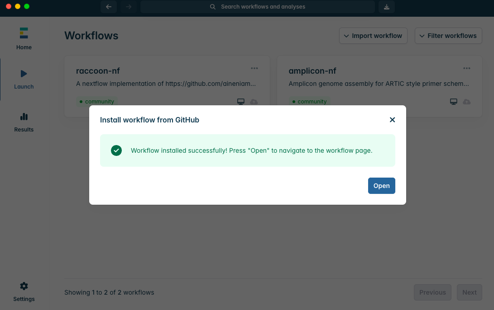

7. You should see the above screen if the workflow installed correctly. Click "Open" to launch the workflow.


---

## 1. Understanding and exploring the datafiles

### Concepts to cover

- ID matching between sequence headers and metadata table rows
- Harmonising metadata from multiple files
- Preserving epidemiologically useful fields in headers

Phylogenetic analysis requires two main types of data: sequence data, in the form of a FASTA file, and metadata, in the form of a TSV (tab separated value) or CSV (comma separated value) file. Often metadata is stored in spreadsheets, such as in Microsoft Excel or Google sheets. If you download a set of sequence data from [Pathoplexus](https://pathoplexus.org/), the accompanying metadata is available as a TSV.


*FASTA files*

A FASTA-formatted file contains sequence records, which can be amino acid or nucleotide sequences. A record minimally contains two pieces of information:

1. The sequence ID (e.g. PP00001)
2. The sequence itself (e.g. CGATCGAT...ACTGACT)

Format details:

- The sequence ID is stored in the header line, denoted by a `>` symbol
- The header line may also contain additional information (sequence description) after the first space
- Important: The sequence ID must not contain whitespace (spaces or tabs)
- The sequence is stored on the following line(s)
- Sequences can be split across multiple lines for readability
- The next record does not start until the next line that begins with `>`

> Select which of the following are good/ valid FASTA records:

a)
```
>PP00010 barcode=barcode01 
AGCTAGCTAGCGTAGCTAGCGCATTACGTACTACG
AGCTAGCTAGCGTAGCTAGCGCATTACGTACTACG
AGCTAGCTAGCGTAGCTAGCGCATTACGTACTACG
```
b)
```
>PP 00011
AGCTAGCTAGCGTAGCTAGCGCATTACGTACTACG
GGCTAGCTAGCGTAGCTAGCGCATTACGTACTACT
TGCTAGCTAGCGTAGCTAGCGCATTACGTACTACA
ACGTAGTCATAGTCGTACTGAC
```
c)
```
PP00012
AGCTAGCTAGCGTAGCTAGCGCATTACGTACTACG
```
d)
```
>PP00013|inis_aine|2026-03-16
AGCTAGCTAGCGTAGCTAGCGCATTACGTACTACG
AGCTAGCTAGCGTAGCTAGCGCATTACGTACTACG
```


*Metadata files*

In order to properly inform our analysis, we need to integrate our sequence data with sequence metadata. Metadata is data that provides additional information about our samples, such as collection date or location. This is ususally supplied as an additional file in CSV or TSV format.

Depending on the data collection process, planning, and ethics approvals, metadata may be very detailed or more sparse. 

> Rank the following types of metadata in order of how useful they may be for genomic epidemiology:
> 
> Location, immune status, travel history, sample collection date, ct value, symptoms, symptom onset date, gender, age, occupation, patient eye colour, patient height

> Which date format should be used as a standard?

> Why should we standardise date formats? 


In this tutorial, you will have *two* FASTA files: 1. A set of background sequence records and 2. A set of *newly generated* consensus sequences that you need to fit into the known diversity and interpret.

We are also providing metadata files to accompany the sequence data. Much of the work in preparing metadata files has already been done, however use these files as a guide for future analyses.


> *Download and unzip the provided files:*
[raccoon_tutorial_data.zip](https://github.com/artic-network/raccoon/blob/main/docs/tutorial/input/raccoon_tutorial_data.zip)

> If you have carried out a sequencing run and have new case data, use that file. Otherwise, a FASTA file of case data can be downloaded from [here](https://github.com/artic-network/raccoon/blob/main/docs/tutorial/input/csaes.fasta.zip).

*Open the input files in a text editor.*

> What information is provided in 1) the FASTA file and 2) the metadata files? 

> What column contains the sequence ID? 

> What column contains the sample date? 

> What column contains the most detailed location data? 

> What other information would be useful for our analysis/ interpretation?


---

## 2: Understanding raccoon-nf pipeline

### Concepts to cover
- What steps are run as part of the raccoon-nf pipeline
- How to set up and run the instance of raccoon-nf

Running best-practice phylogenetics can be challenging, however with the raccoon-nf pipeline a simple alignment and phylogenetic workflow can be performed in a single step. The pipeline itself is configurable, however in this tutorial we will be running the steps shown in the figure below.

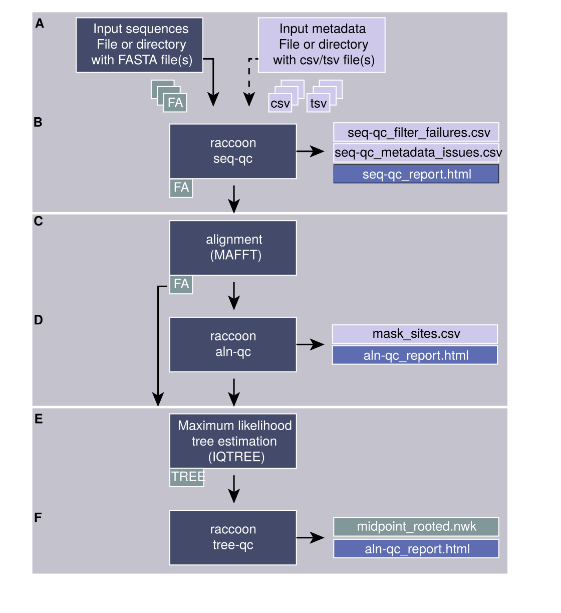

### Pipeline details

A) *Input files*
- input sequences (one or more fasta files or directory containing fasta file)
- input metadata (one or more metadata files (csv or tsv) or directory containing metadata files)

B) *raccoon seq-qc*

Outputs:
- a combined fasta file with sequence headers harmonised and populated from the metadata fields
- seq-qc_report.html (a report describing the dataset, the matching, the output and any issues identified with the data)
- seq-qc_filter_failures.csv (sequences that do not pass qc filters, max n and min length)
- seq-qc_metadata_issues.csv (flagging missing metadata fields or sequences that failed to match metadata)

C) *alignment*

Multiple sequence alignment is a key step prior to running phylogenetics. It is the scaffold upon which we can begin to reconstruct the evolutionary relationships between different sequences in the tree. We will run alignment using [MAFFT](https://academic.oup.com/nar/article/30/14/3059/2904316), which is a popular software tool for creating multiple sequence alignments. 

Output:
- An aligned fasta file

D) *raccoon aln-qc*

 A high-quality alignment is crucial to generating a good phylogenetic tree. Being able to accurately assess whether there are issues with your multiple sequence alignment is a key skill that we will cover today. 
 
 The alignment is checked for various issues that may impact the quality of the phylogenetic inference. Different kinds of SNPs (clustered SNPs, N-adjacent SNPs, gap-adjacent SNPs) are flagged that may suggest issues with the alignment or with a given sequence. If a given sequence has many issues flagged (default >20), that sequence is flagged for removal from the analysis. Flagged SNPs do not necessarily mean there is anything wrong with the SNP, it may reflect genuine biological variation. However, these sites may need to be investigated closely.

Output:
- aln-qc_report.html (a report describing the input alignment, n content and any SNPs that were flagged as possibly pro)
- mask_sites.csv (describes the sites flagged for investigation or masking and the sequences flagged for removal)

E) *tree estimation*
Tree building is run using [IQTREE](https://academic.oup.com/mbe/article/37/5/1530/5721363). The substitution model used is configurable and an outgroup can optionally be included. If an outgroup is included, ancestral state reconstruction will be run during the tree building process to provide additional checks on the tree, and the outgroup sequence will be pruned off from the final tree. In this case, as we are not yet familiar with the data, we will not select an outgroup as it is not clear what an appropriate outgroup would be.

Key output:
- *.treefile (a maximum likelihood tree file)

F) *raccoon tree-qc*

Output:
- tree-qc_report.html (report showing the tree, a root to tip and any issues that were flagged during the tree-qc process)
- *.phylo_flags.csv
- A midpoint rooted tree (if no outgroup provided)
- Branch reconstruction file (if outgroup provided)
- State difference file (if outgroup provided)

---
## 3. Running raccoon-nf in EPI2ME


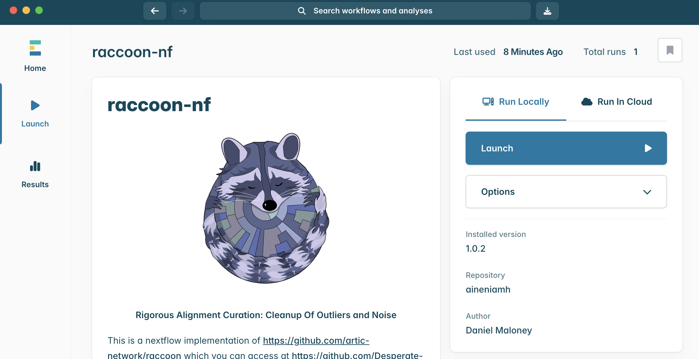

1. To launch an instance of the raccoon-nf workflow, click the "Launch" button.

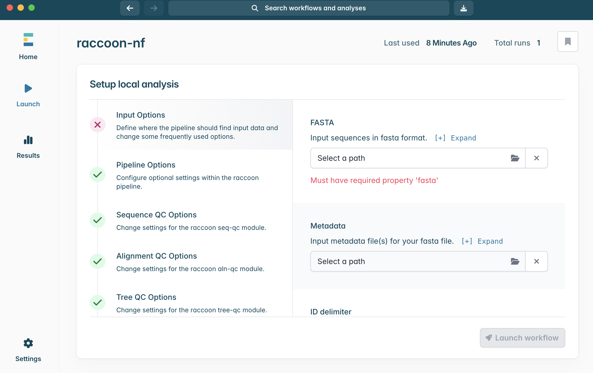

2. This will open the above window, with all the configuration options for the analysis. Minimally, the pipeline requires a FASTA input to run. Today we will run with two FASTA files (background historical data, and the newly sequenced case sequence data) and the two metadata files with a row corresponding to each of the sequence records. 


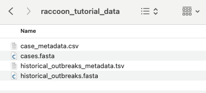

3. If you haven't already, make sure to download and unzip [raccoon_tutorial_data.zip](https://github.com/artic-network/raccoon/blob/main/docs/tutorial/input/raccoon_tutorial_data.zip). Drag your newly sequenced case FASTA file to the same directory, as shown above. The directory should now contain four files.

4. In the `Input Options` panel, select the directory that contains your FASTA files (it should have unzipped into a directory called "raccoon_tutorial_data"), and select the same directory for your metadata files. Raccoon-nf will automatically detect which files present are FASTA files and which ones are metadata files based on the file extensions (i.e. `.fasta` or `.csv`/`.tsv`). We can leave the remaining `Input options` as default.


5. We will leave pipeline options as default for this tutorial, but feel free to explore the configurable pipeline settings.

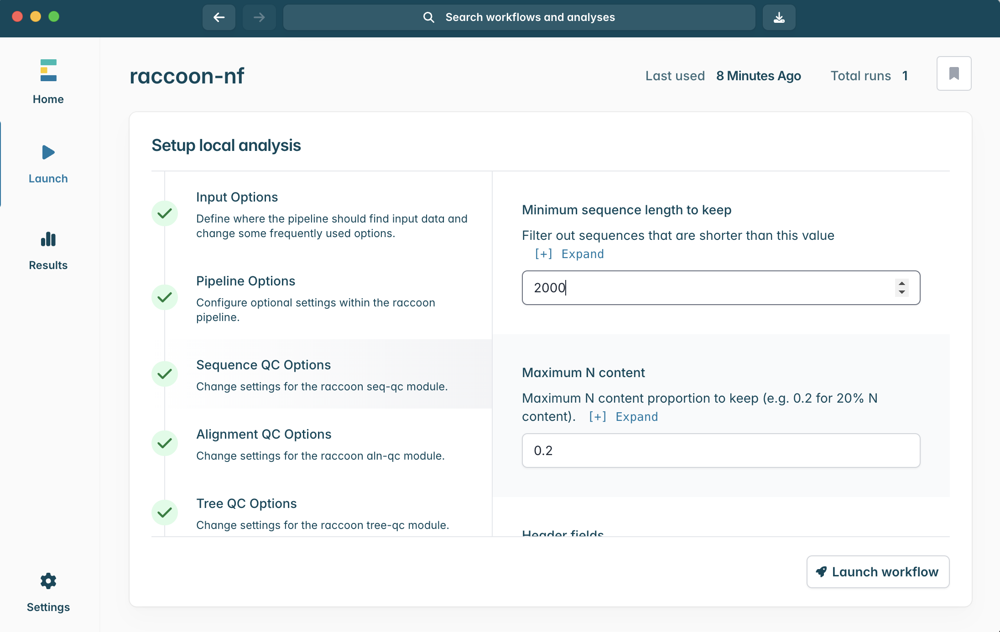

6. Click into Sequence QC options. We can tell you we know the example genome is ~3,200 nucleotide bases in length. When setting up our raccoon-nf run, we want to include genome sequences that are complete, or nearly complete genomes. 

> What would a sensible minimum sequence length be for this analysis?

> What would a good maximum N content be? What are the tradeoffs?

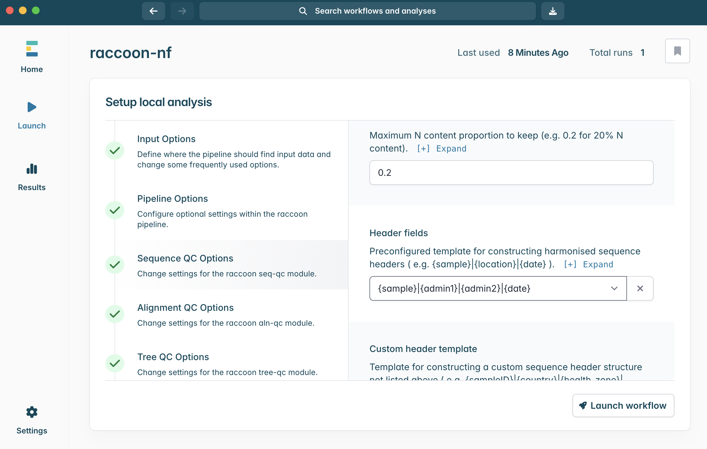

8. Scroll down within Sequence QC options to `Header fields`. The default header template is `{sample}|{location}|{date}`. Think back to our exploration of the provided metadata files. Will this template match up with our metadata? (Hint: look at the column headers)


> Given three alternative templates below, rank them best → worst and justify:

1. `{sample}|{date}`
2. `{sample}|{admin1}|{admin2}|{date}`
3. `{admin2}|{date}`
3. `{sample}|{location}|{date}`


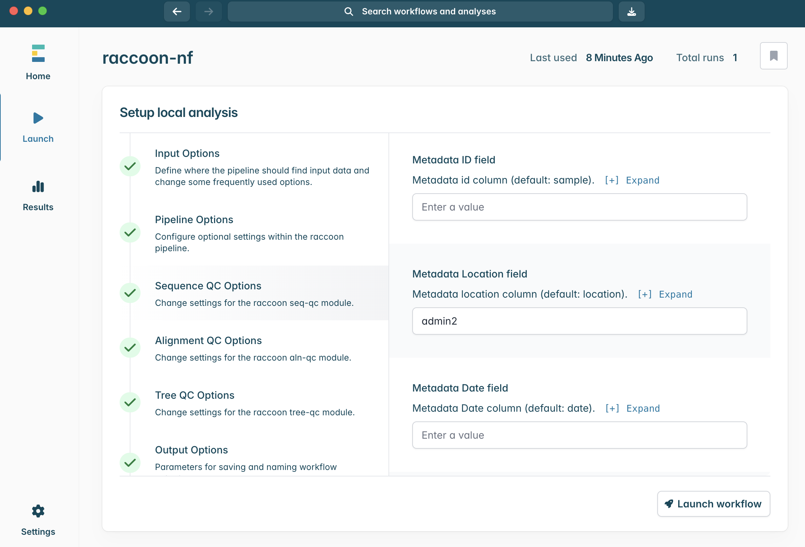

7. Scroll down in Sequence QC options. The default Metadata ID field is `sample`, which matches with our metadata. Similarly, the Metadata Date field default `date` matches our metadata files. However, the Metadata Location field differs (default is location, however we are using `admin1` and `admin2`). Write in the location column we would like to have raccoon use. 

> Between admin1 and admin2, which is the better choice? 

> What would impact this choice? (Hint: think of how complete metadata may be)

8. We will leave Alignment QC Options, Tree QC Options, Output Options and Nextflow configuration as default in this tutorial. Feel free to explore configuration options. 

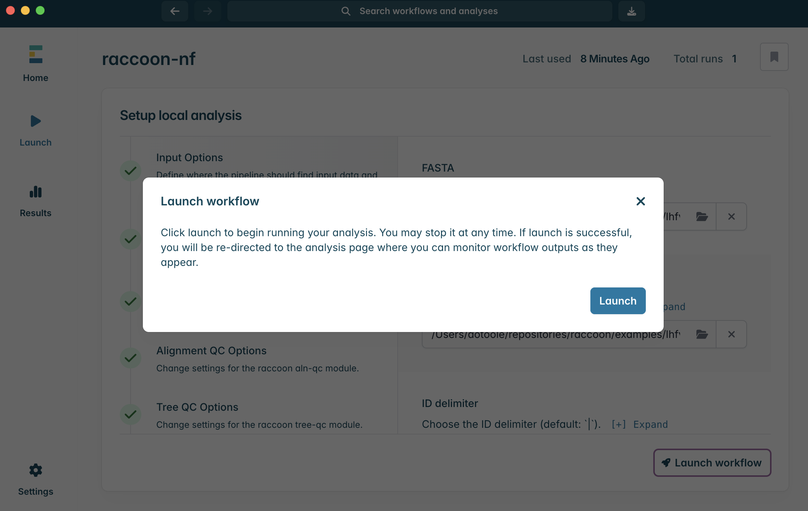

9. To Launch the workflow, click `Launch workflow` in the bottom right corner. A window should pop up. Click `Launch` to start the pipeline.

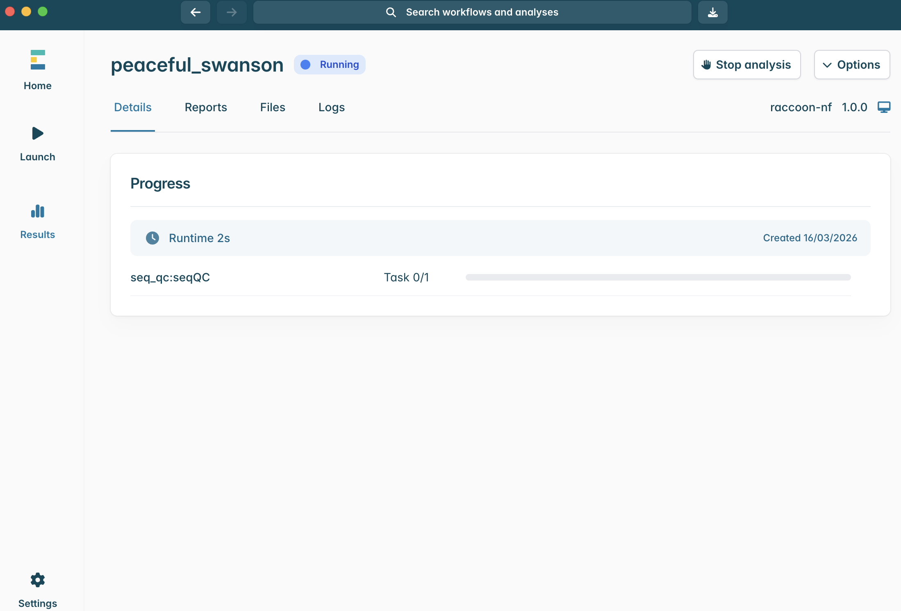

9. The pipeline will begin running and you can monitor the progress of each step. 


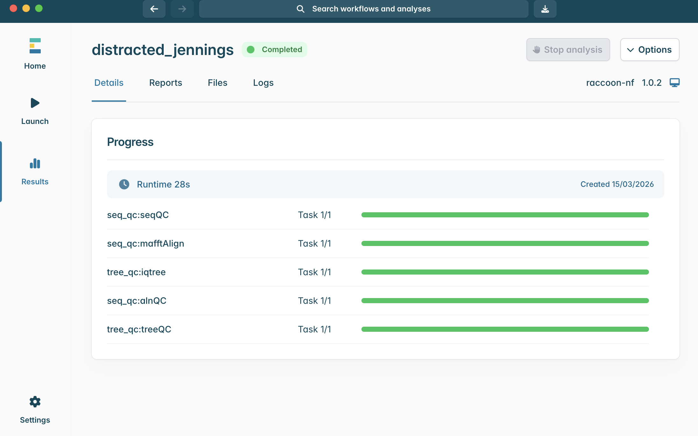

9. When the pipeline successfully runs all steps, you will see the progress status change from `Running` to `Completed`.

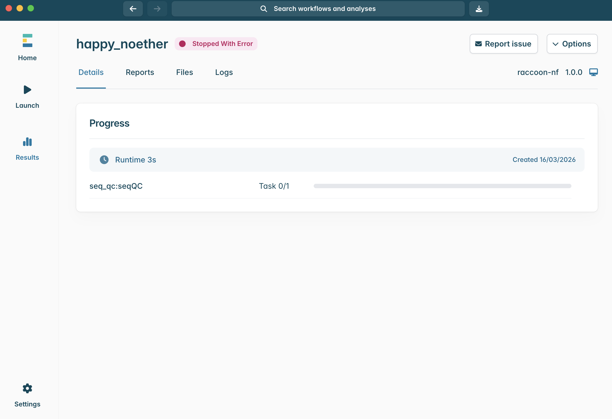

10. If the `Running` status does not change to `Completed` and instead it turns red and changes to `Stopped With Error`, something has gone wrong. The ability to read and interpret error messages is the *most useful* skill for any bioinformatician to have. If you see this message, navigate to the `Logs` menu. 


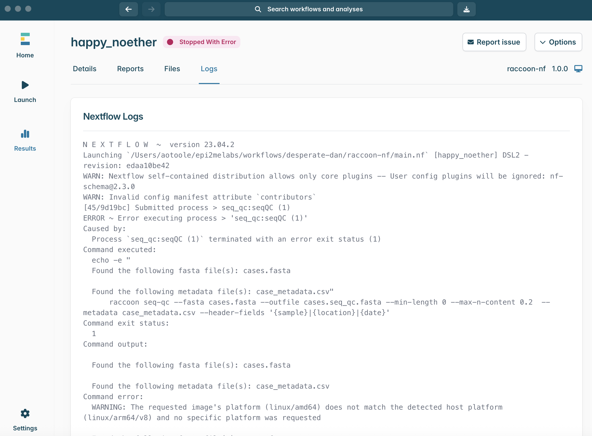

11. The Logs window shows the output from Nextflow as it runs and any error messages will show at the bottom of the print out. This log can look rather intimidating, however it contains a lot of useful information! If you have an error, scroll down to the bottom of the log. Can you identify the error message? (Hint: it often is printed following the word "ERROR").

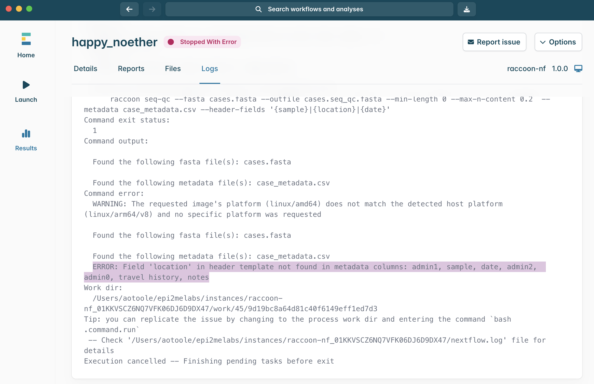

12. In this example, the error reads "ERROR: Field 'location' in header template not found in metadata columns: admin1, sample, date, admin2, admin0, travel history, notes"

> What does that suggest went wrong during this pipeline run?

> How would you solve this error when you run the pipeline next time? 

**Checkpoint questions:**
- What criteria are used to filter sequences?
- If our metadata file contained the following columns – ID, country, health_zone, sample_date – what would an appropriate header fields template be? 
- Where can you find information that can help explain an error?


---

## 4. Interpreting the output of raccoon-nf

1. Navigate to the `Reports` tab. 

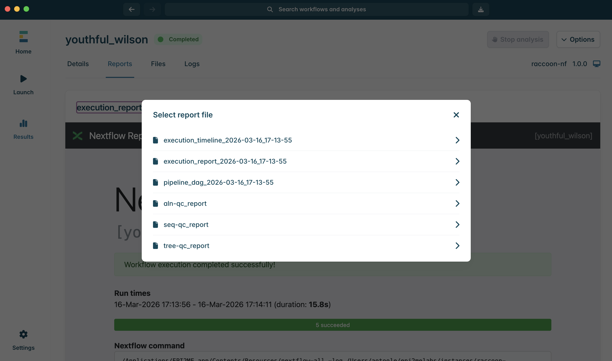

2. Click on `execution_report.... ⌄` to view the available reports. Select `seq-qc_report.html` to open the seq-qc report.


---

## Step 3: Alignment Quality Control

Assess the quality of your alignment:

```bash
raccoon aln-qc examples/mev/aln-qc/mev_sample.aln.fasta -d examples/mev/aln-qc/
```

**Questions:**
- What metrics are used to evaluate alignment quality?
- How can poor alignment affect downstream analysis?

---

## Step 4: Masking and Tree Construction

Mask problematic sites and infer a phylogenetic tree:

```bash
raccoon mask examples/mev/aln-qc/mev_sample.aln.fasta --mask-file examples/mev/aln-qc/mask_sites.csv -d examples/mev/masked/
iqtree -s examples/mev/masked/mev_sample.aln.masked.fasta -m HKY -czb -blmin 0.00000001 -asr  -o 'PP_003MAAS.2||2019'
```

**Questions:**
- What is the purpose of masking sites in an alignment?
- What does the HKY model represent in IQ-TREE?

---

## Step 5: Tree Pruning and QC

Prune the tree and run phylogenetic QC:

```bash
jclusterfunk prune  -i "examples/mev/masked/mev_sample.aln.masked.fasta.treefile" -t 'PP_003MAAS.2||2019' -o 'examples/mev/masked/mev_sample.pruned.tree'
raccoon tree-qc --phylogeny 'examples/mev/masked/mev_sample.pruned.tree' --asr-state examples/mev/masked/mev_sample.aln.masked.fasta.state --alignment examples/mev/masked/mev_sample.aln.masked.fasta -d examples/mev/tree-qc/
```

**Questions:**
- Why might you prune a phylogenetic tree?
- What QC metrics are important for phylogenetic trees?

---

## Discussion

- What challenges did you encounter during the workflow?
- How would you adapt this pipeline for a different virus or dataset?

---

## Additional Resources

- [Raccoon Documentation](link-to-docs)
- [MAFFT Manual](https://mafft.cbrc.jp/alignment/software/)
- [IQ-TREE Documentation](http://www.iqtree.org/doc/)
- [jclusterfunk GitHub](https://github.com/rob-p/jclusterfunk)

---
